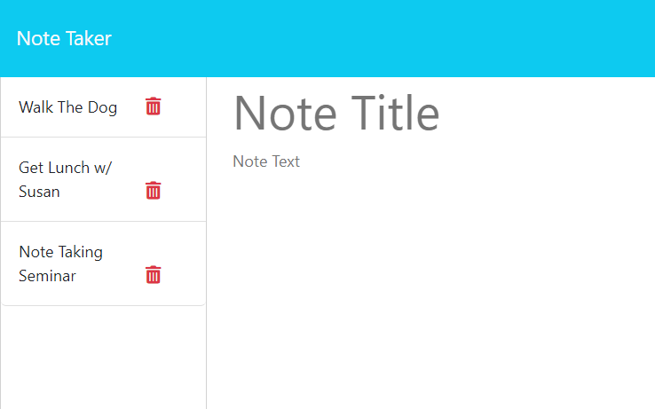

# Dylan's Note-Taker Application

## Table of Contents

- [Project Overview](#project-overview)
- [Built With](#built-with)
- [Features](#features)
- [Screenshots/Deploy](#screenshotsdeploy)
- [License](#license)

## Project Overview

I made this webpage to demonstrate my current level of knowledge with Javascript and to showcase my ability to build light applications. 

## Built With

- HTML
- CSS
- Javascript
- NodeJS and Node Package Manager
- Express
- Heroku

## Features

- User is presented with a landing page with a link to a notes page.
- User is presented with a page with existing notes listed in the left-hand column, plus empty fields to enter a new note title and the note’s text in the right-hand column
-  Accessible "Save Note" button and a "Clear Form" button appear in the navigation at the top of the page.
- When user clicks on the Save button, the new note user has entered is saved and appears in the left-hand column with the other existing notes.

## Screenshots/Deploy

 [Note-Taker Application](https://github.com/DylanOzzy/Note-Taker)

 

 [Heroku Link]()

## License

MIT License

Copyright (c) [2023] Dylan Osborn

Permission is hereby granted, free of charge, to any person obtaining a copy
of this software and associated documentation files (the "Software"), to deal
in the Software without restriction, including without limitation the rights
to use, copy, modify, merge, publish, distribute, sublicense, and/or sell
copies of the Software, and to permit persons to whom the Software is
furnished to do so, subject to the following conditions:

The above copyright notice and this permission notice shall be included in all
copies or substantial portions of the Software.

THE SOFTWARE IS PROVIDED "AS IS", WITHOUT WARRANTY OF ANY KIND, EXPRESS OR
IMPLIED, INCLUDING BUT NOT LIMITED TO THE WARRANTIES OF MERCHANTABILITY,
FITNESS FOR A PARTICULAR PURPOSE AND NONINFRINGEMENT. IN NO EVENT SHALL THE
AUTHORS OR COPYRIGHT HOLDERS BE LIABLE FOR ANY CLAIM, DAMAGES OR OTHER
LIABILITY, WHETHER IN AN ACTION OF CONTRACT, TORT OR OTHERWISE, ARISING FROM,
OUT OF OR IN CONNECTION WITH THE SOFTWARE OR THE USE OR OTHER DEALINGS IN THE
SOFTWARE.
